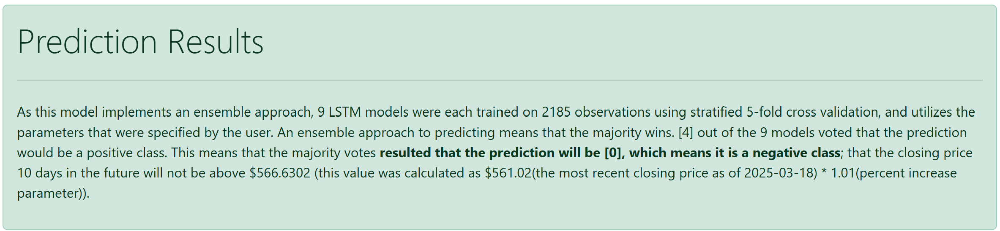
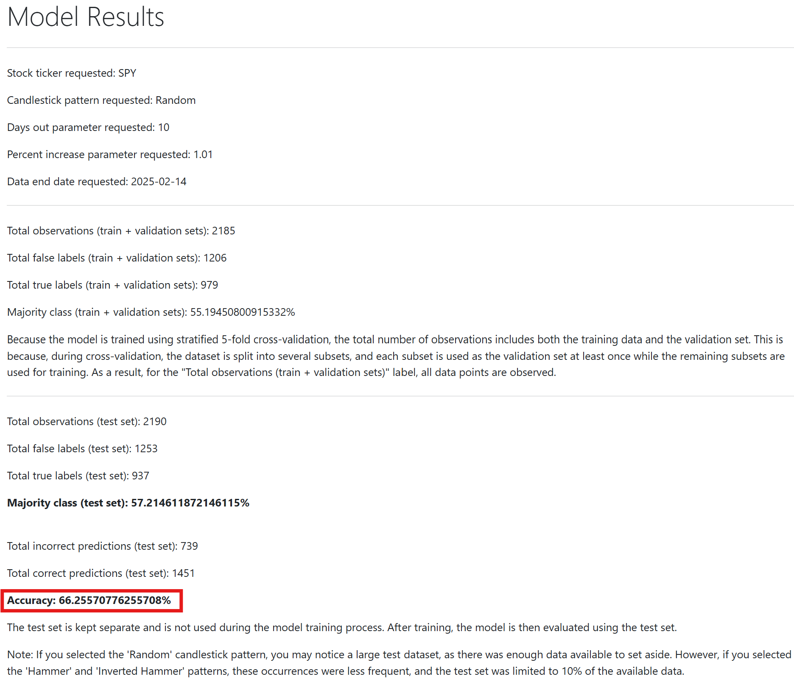

# LSTM_Stock_Price_Prediction_App
This Flask web application leverages an ensemble of LSTM neural networks to predict short-term stock price movements. It also serves as my capstone project for the Master of Science in Data Analytics program at Western Governors University.

Using a neural network model like a LSTM to predict stock price movements I was able to deliver accurate forecasts based on historical stock price data and technical indicators like RSI, MACD, and MFI. **My model is able to predict future short-term stock price movements significantly more accurate than guessing.**

* Below is an output from my application when a prediction from my model is retrieved:

* For the prediction shown in the image above, we can see below in the image, the summary data for model training which is also available in my app.

* By combining bullish candlestick patterns with these additional indicators, traders can make better-informed decisions instead of relying solely on pattern analysis. LSTM models excel at capturing long-term trends, which makes its use ideal for stock price predictions. My model is trained with 30-day sequences, where each sequence includes 30 time steps (with each day representing one time step). For each time step, I use eight features: [Stock Price Open, Close, High, Low, RSI, MACD, Signal Line, MFI].

## Requirements for running this application

I used Amazon EC2 instance to host my web application. However, due to the costs of keeping the instance running, there is no direct link to the application, I currently have the application stopped. If you need me to turn on the application briefly, feel free to shoot me an email. Otherwise, you can download it onto your local computer, set up your own EC2 instance, or whatever cloud provider you choose to run this application.

Using my own PC, which has an Intel(R) Core(TM) Ultra 9 processor and 32.0 GB of RAM, I am able to smoothly run the application. However, when hosting the same application on an EC2 instance (type c5.2xlarge, with 8 CPUs and 16.0 GB of memory), I noticed that model training was a bit slower, but it was still able to smoothly run the application.

I used a Ubuntu EC2 instance installed with Python 3.11. The steps to install my app on a Ubuntu instance are as follows once a Ubuntu instance has been created:

1. Transfer the "web_app" folder via WinSCP to the Ubuntu instance.
2. In the Ubuntu terminal for your EC2 instance, once it is first loaded up, enter the following:
   1. sudo apt-get update
   2. sudo apt install -y software-properties-common
   3. sudo add-apt-repository ppa:deadsnakes/ppa
   4. sudo apt update
   5. sudo apt install python3.11
   6. python3.11 --version
   7. sudo apt install python3.11-distutils
   8. curl https://bootstrap.pypa.io/get-pip.py -o get-pip.py
   9. python3.11 get-pip.py
   10. sudo apt install python3-pip
   11. sudo apt install python3.11-venv
3. In the ubuntu terminal, navigate inside the "web_app" folder
  1. cd <Enter Path To 'web_app' folder>
  2. python3.11 -m venv myflaskenv
  3. source myflaskenv/bin/activate
  4. pip3 install -r requirements.txt
  5. python3.11 app.py
